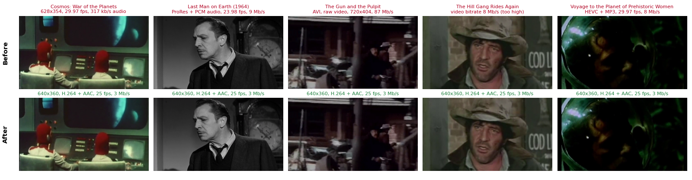
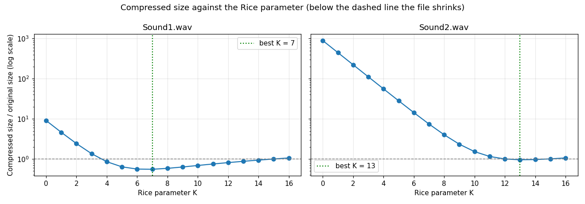

# Media Compression Tools

Two tools for working with audio and video formats in Python: a **lossless audio codec** built from scratch with Rice coding, and an **automatic film format checker and converter** built on ffprobe and ffmpeg.

| Tool | Notebook | Run it |
|---|---|---|
| Rice coding audio codec | [`rice_coding_audio_compression.ipynb`](rice_coding_audio_compression.ipynb) | [](https://colab.research.google.com/github/ziadelh/media-compression-tools/blob/main/rice_coding_audio_compression.ipynb) |
| Film format checker and converter | [`film_format_converter.ipynb`](film_format_converter.ipynb) | [](https://colab.research.google.com/github/ziadelh/media-compression-tools/blob/main/film_format_converter.ipynb) |



<sub>Five film excerpts in five different formats, before and after conversion. Every one failed the audit and every converted copy passes.</sub>

## 1. Lossless audio compression with Rice coding

An encoder and decoder for 16-bit WAV files, with its own `.ex2` file format. A WAV file goes through a **delta predictor** (each sample is replaced by its difference from the previous one), **ZigZag mapping** (signed numbers become non-negative) and **Rice coding** (a unary quotient plus `k` remainder bits, so only shifts and masks are needed). Decoding reverses every step, and the notebook checks that the recovered samples are identical to the original, so nothing is lost.



| File | Original | K = 2 | K = 4 | Best K | At the best K |
|---|---|---|---|---|---|
| `Sound1.wav` | 1,002,088 bytes | 2,429,928 (-142.5%) | 857,474 (**14.4%** smaller) | 7 | 555,614 (**44.6%** smaller) |
| `Sound2.wav` | 1,008,044 bytes | 224,816,527 (-22,202%) | 56,448,286 (-5,500%) | 13 | 964,009 (4.4% smaller) |

**Why the two files behave so differently.** A Rice code spends `q + 1 + k` bits on a value, where `q` is the value divided by `2^k`. Sound1's prediction residuals are small (about 72 on average), so a small `k` is cheap and it compresses well. Sound2's residuals are about 100 times larger (about 7,100 on average), so with `k = 2` the unary part runs to thousands of bits per sample and the "compressed" file ends up 220 times bigger than the original. Choosing `k` from the size of the residuals fixes it: the best `k` is roughly the base-2 logarithm of their mean.

**Speed.** The notebook keeps the simple one-bit-at-a-time encoder and decoder as a reference, and adds a NumPy encoder and a 64-bit-lookup decoder that produce **byte-identical output**. The notebook checks this on a slice of both files, and I also compared the whole 225 MB file that `Sound2` at `k = 2` creates. The reference encoder alone needs about 19 minutes for that one file, while the whole notebook with the fast codec runs in about five minutes.

## 2. Film format checker and converter

A film festival receives films in many formats, and each one must be delivered as: **mp4 container, H.264 video, AAC audio, 25 fps, 16:9 at 640 x 360, 2 to 5 Mb/s video, up to 256 kb/s audio, stereo**.

1. `ffprobe` reads every film's container, codecs, frame rate, resolution, bitrates and channels.
2. Each film is validated against the specification, and a plain-text report lists the films that fail and the problem fields ([`reports/`](reports)).
3. Only the failing films are converted with `ffmpeg` to `<name>_formatOK.mp4`. A film with no audio track gets a silent stereo track.
4. The converted films are probed again and a second report confirms they pass.

On the five supplied excerpts all five failed, for different reasons:

| Film | Problems found |
|---|---|
| Cosmos: War of the Planets | 628x354 resolution, 29.97 fps, 317 kb/s audio |
| Last Man on Earth (1964) | ProRes video, PCM audio, 23.98 fps, 9 Mb/s video, 2 Mb/s audio |
| The Gun and the Pulpit | AVI container, raw video, PCM audio, 720x404, 87 Mb/s video |
| The Hill Gang Rides Again | 8 Mb/s video |
| Voyage to the Planet of Prehistoric Women | HEVC video, MP3 audio, 29.97 fps, 8 Mb/s video, 320 kb/s audio |

After conversion all five are 640x360 H.264 and AAC at 25 fps and about 3 Mb/s, and pass the second audit.

## Run it

Use the Colab buttons above, or run locally:

```bash
pip install -r requirements.txt
jupyter notebook
```

The film tool needs [FFmpeg](https://ffmpeg.org/download.html) on your PATH (Colab already has it). The five film excerpts are about 160 MB, so they are not stored in the repository: the notebook downloads them from the [`data-v1` release](https://github.com/ziadelh/media-compression-tools/releases/tag/data-v1) the first time it runs.

## Files

| Path | Purpose |
|---|---|
| `rice_coding_audio_compression.ipynb` | The codec, its verification and the analysis of `k` |
| `film_format_converter.ipynb` | The probe, audit, conversion and re-audit pipeline |
| `data/sound/` | The two WAV files used by the codec |
| `reports/` | The pre- and post-conversion audit reports from a run |
| `results/` | The compression results as CSV |

## Credits

The two sound files and the five film excerpts were supplied with the course.

## Tech Stack

Python · NumPy · pandas · Matplotlib · FFmpeg (ffprobe, ffmpeg)

## Author

Ziad Elhussein
